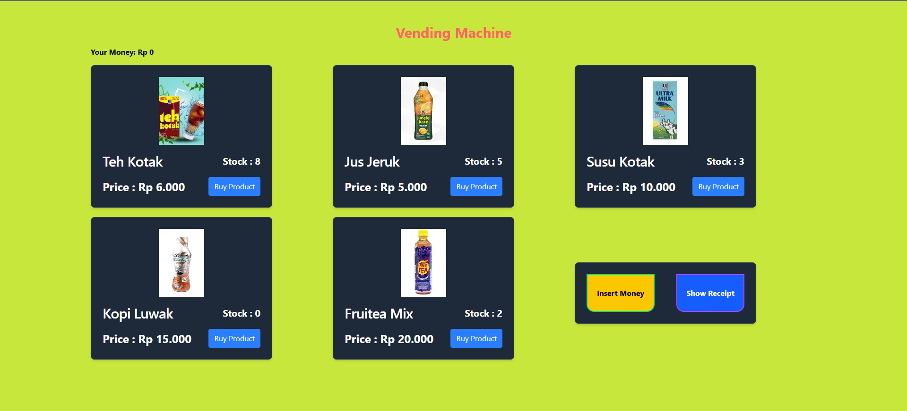
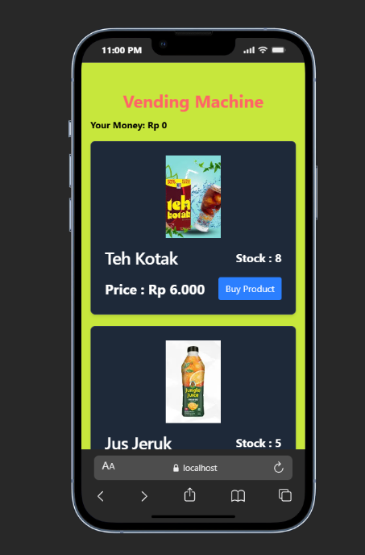

Aplikasi Vending Machine sederhana berbasis web yang mensimulasikan proses pembelian minuman/makanan seperti mesin vending pada umumnya.
Pengguna dapat memasukkan uang dengan nominal tertentu, membeli produk, mendapatkan kembalian, serta melihat stok produk yang tersedia, serta dapat mengetahui history pembelian dalam bentuk receipt. Aplikasi ini dibuat sebagai Frontend Developer Test dengan fokus pada interaksi UI, state management, dan komunikasi dengan mock API.

✨ Fitur Utama

- Menampilkan daftar produk vending machine

- Menampilkan gambar, nama produk, harga, dan stok

- Simulasi memasukkan uang (Rp2.000, Rp5.000, Rp10.000, Rp20.000, Rp50.000)

- Total uang ditampilkan secara real-time

- Validasi pembelian (uang kurang / stok habis)

- Pengurangan stok setelah pembelian

- Penyimpanan riwayat transaksi

- Tombol pengembalian uang

🖥️ Teknologi yang Digunakan

- Frontend: React JS + TypeScript

- Styling: Tailwind CSS + Flowbite React

- State Management: React Hooks & Context API

- Mock API: json-server

- HTTP Client: Axios

📦 Instalasi & Menjalankan json-server

1) Masuk ke folder backend
   cd backend

2) install dependency
   npm install

3) jalankan json-server
   npm run dev

4) server akan berjalan di
   http://localhost:3001

📡 API Routes (json-server)

   Base URL:
   http://localhost:3001

   - GET /products
   - PATCH /products/:id
   - GET /transaction
   - POST /transaction

▶️ Menjalankan Aplikasi (Frontend)

1) Masuk ke folder frontend
   cd frontend

2) Install dependency
   npm install

3) Jalankan development mode
   npm run dev

🖼️ Screenshots

### Tampilan Utama

 ## Tampilan Utama (Mobile)
 

### Insert Money

 
 ![History Pembelian](./screenshorts/responsive-receipt.png
 
📝 Catatan Tambahan

- Fitur popup masih menggunakan alert sederhana.
- Belum tersedia sistem autentikasi pengguna.
- Pembuatan dibuat sesederhana mungkin
- Belum ada fitur untuk admin
